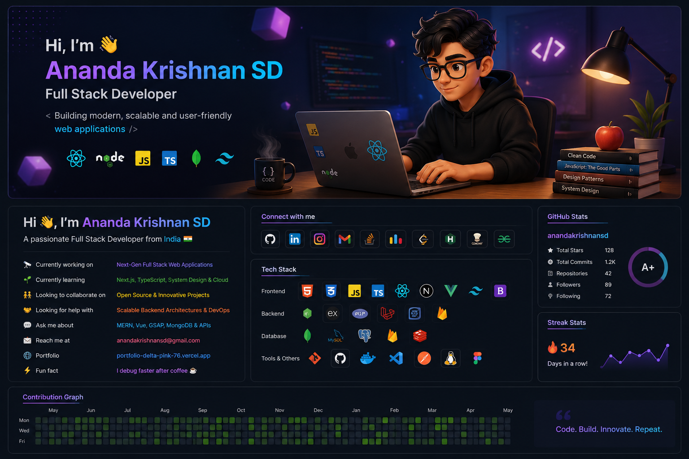

  

<h1 align="center">Hi 👋, I'm Ananda Krishnan SD</h1>

<h3 align="center">
🚀 Full Stack Developer | MERN Stack | UI/UX Enthusiast | Problem Solver
</h3>

  

  

---

# 💫 About Me

- 🔭 Currently working on **Next-Gen Full Stack Web Applications**
- 🌱 Currently learning **Next.js, TypeScript, System Design & Cloud**
- 👯 Looking to collaborate on **Open Source & Startup Projects**
- 🤝 Looking for help with **Scalable Backend Architectures**
- 💬 Ask me about **React, Vue, GSAP, MERN & APIs**
- ⚡ Fun fact: **I debug faster after coffee ☕**

---

# 🌐 Connect With Me

---

# ⚡ Tech Stack

## 🎨 Frontend

  

## ⚙️ Backend

  

## 🗄️ Database

  

## 🛠️ Tools & Platforms

  

## 👨‍💻 Languages

  

---

# 🚀 Featured Projects

## 🔹 Smart Slot Booking System
> Real-time slot booking platform with optimized scheduling and backend integration.

## 🔹 Animated Portfolio Website
> Modern portfolio with GSAP animations, dark neon UI and responsive design.

## 🔹 Full Stack Admin Dashboard
> Dashboard with authentication, analytics, APIs and role-based management.

---

# 🎯 2026 Goals

- 🚀 Build scalable SaaS products
- 🌍 Contribute to Open Source
- ☁️ Learn DevOps & Cloud
- 🧠 Master System Design
- 📱 Build modern AI-integrated applications

---

# 📊 GitHub Stats

  
  
  

  

---

# 🏆 GitHub Achievements

---

# 📈 Contribution Graph

---

# 🐍 Contribution Snake

---

# ☕ Developer Quote

---

# 🎵 Coding Vibes

  

---

# 💻 Coding Activity

---

<h3 align="center">
✨ Code • Build • Innovate • Repeat ✨
</h3>
